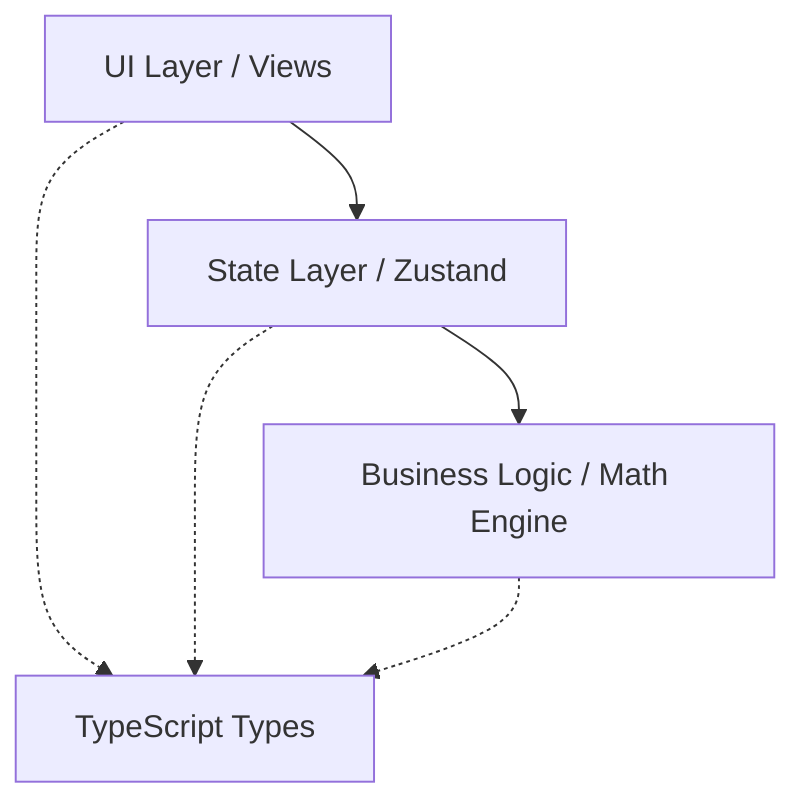

# Arquitectura y Documentación Técnica
**Calculadora de Préstamos Pro**

Este documento sirve como referencia técnica sobre la estructura, decisiones de diseño y el funcionamiento del motor de cálculo financiero de la aplicación.

## 1. Arquitectura General

El proyecto sigue una arquitectura modular en capas para separar responsabilidades de manera limpia:

*   **UI Layer (`/app`, `/src/components`):** Maneja la renderización, navegación (Expo Router) y captura de inputs.
*   **State Layer (`/src/store/useLoanStore.ts`):** Gestiona los parámetros del préstamo, resultados calculados y la persistencia local.
*   **Business Logic (`/src/utils/loanMath.ts`):** Motor de cálculo puro, sin dependencias de React, altamente testeable.
*   **Types (`/src/types/index.ts`):** Contratos de datos compartidos por todas las capas.

## 2. Motor de Cálculo (`loanMath.ts`)

El núcleo financiero de la app está diseñado para replicar las prácticas bancarias peruanas usando alta precisión (`decimal.js`).

### 2.1 Sistema Francés y Tasas
*   **Sistema Francés:** Calcula cuotas totales fijas. La porción de interés disminuye y la de amortización aumenta mes a mes.
*   **Conversión de Tasas:** Todas las tasas ingresadas (TEA, TEM, TNA) se normalizan a una tasa mensual (TEM) o diaria (TED) equivalente, dependiendo del calendario seleccionado.

### 2.2 Mes Comercial vs. Días Reales
*   **Mes Comercial (30/360):** Asume que todos los meses tienen 30 días. Permite el uso directo de la fórmula de anualidad estándar para encontrar la cuota teórica perfecta.
*   **Calendario Real (Días Exactos):** Utiliza `date-fns` para contar los días reales transcurridos entre cada pago (28, 29, 30 o 31 días).
*   **El desafío de la convergencia (Amortización Negativa):** En el Calendario Real, los intereses fluctúan. El uso de la cuota fija teórica en plazos largos (ej. 300 meses) con tasas altas provocaba que el saldo no llegara a cero (e incluso creciera exponencialmente al final). 
*   **Solución Algorítmica:** Se implementó una **búsqueda iterativa por bisección** que ajusta la cuota asumiendo variaciones mínimas hasta forzar que la tabla finalice con un saldo remanente exactamente igual a cero.

## 3. Simulador de Prepagos

El motor soporta la inyección de pagos extraordinarios en cualquier mes, simulando sus dos posibles efectos normativos:

1.  **Reducir Cuota:** El plazo total original se mantiene. Tras aplicar el prepago, se vuelve a calcular la cuota necesaria para amortizar el saldo restante en los meses faltantes, resultando en cuotas más bajas.
2.  **Reducir Plazo (Terminar Antes):** La cuota original se mantiene (o se aproxima lo máximo posible). Al abonar más capital cada mes, el saldo pendiente se reduce aceleradamente, liquidando el préstamo en menos meses.
3.  **Validación de Liquidación:** El motor detecta si el monto del prepago supera el saldo pendiente en ese momento, ajustando la cuota final y cerrando la tabla anticipadamente para evitar saldos negativos.
4.  **Cálculo de Ahorro:** Se comparan los intereses totales de la simulación base vs. la simulación con prepago para proyectar el ahorro en el resumen.

## 4. Estructura del Store (`useLoanStore.ts`)

Centraliza el estado mediante `zustand` y persiste datos con `AsyncStorage` (vía `partialize`).

*   **Datos Persistidos:** `monto`, `tasaInteres`, `tipoTasaFija`, `tipoCalendario`, `plazoMeses`, `seguroDesgravamenRateMensual`, `moneda`, `prepago` y `originalMetrics`. Esto permite que el usuario cierre y reabra la app recuperando su última simulación intacta.
*   **Datos Volátiles:** `amortizationTable` y `tcea`. Se recalculan en memoria al montar o modificar la simulación para evitar guardar un JSON gigante en disco.
*   **Preservación de `originalMetrics`:** Se persisten las métricas originales para que, al recargar la app con un prepago activo, la UI y el PDF aún puedan calcular y mostrar el texto de "Ahorro proyectado", el cual depende de los valores de la tabla *sin prepago*.

## 5. Generación de PDF (`index.tsx`)

Módulo robusto para exportar cronogramas, basado en `expo-print` (HTML a PDF) y `expo-sharing`.

1.  **Flujo:** `HTML String` → `printToFileAsync` → `File move` → `shareAsync`.
2.  **Manejo de Caché Seguro:** Antes de mover el nuevo PDF a la ruta final, se verifica y elimina (si existe) cualquier archivo previo (`FileAlreadyExistsException`) para evitar colisiones y saturación de caché.
3.  **Paginación CSS:** Se controla la partición del documento mediante `page-break-inside: avoid` en elementos clave (`<tr>`, `.summary`, `.no-break`) asegurando que el Aviso Legal y las tarjetas de resumen nunca se corten por la mitad.
4.  **Repetición de Cabeceras:** El bloque `<thead>` incluye `display: table-header-group` para que el motor de impresión repita los títulos de las columnas al iniciar una nueva página.
5.  **Cabeceras Dinámicas y Plazo Real:** 
    *   La columna "Seguro" se oculta dinámicamente si no está activo.
    *   **Plazo Real:** La cabecera del PDF usa el *plazo efectivo* (calculado desde la última fila de la tabla generada), no el `plazoMeses` del input original. Esto resuelve un bug real donde el PDF mostraba el plazo original a pesar de que un prepago con "Terminar Antes" había liquidado la deuda anticipadamente.
    *   El documento incluye un disclaimer legal alineado con la Guía del Simulador y muestra un resumen detallado del prepago activo (monto, mes, ahorro en intereses) cuando corresponde.

## 6. Decisiones de Diseño

*   **Sin presets rígidos de bancos:** Las tasas de interés y seguros varían constantemente según el perfil crediticio. Proveer una entrada manual empodera al usuario con el cálculo real.
*   **Seguro de Desgravamen Opcional:** Alineado al cambio normativo de la SBS (Septiembre 2025), el seguro de desgravamen ya **no es obligatorio** en Perú para créditos personales (solo para hipotecarios). Se maneja mediante un *toggle*.
*   **Cálculo Riguroso de la TCEA:** La TCEA se calcula mediante el método de Tasa Interna de Retorno (TIR) usando búsqueda por bisección (hasta 50 iteraciones) sobre el flujo de caja completo del préstamo (desembolso vs. cuotas totales), no como una simple fórmula cerrada. Se etiqueta como "Estimada (Referencial)" porque, aunque el método es matemáticamente exacto para las variables dadas, puede no coincidir 1-a-1 con el reporte SBS del banco debido a diferencias en reglas de redondeo por día, o a gastos adicionales (portes, comisiones) que ciertas entidades sí podrían incluir y que la app no contempla.

## 7. Suite de Tests (`loanMath.test.ts`)

La cobertura asegura que las funciones matemáticas no sufran regresiones:

| Test Name | Cobertura de Negocio / Regresión prevenida |
| :--- | :--- |
| `12-month loan accurately with TEA (commercial)` | Escenario básico estándar de banco retail. |
| `24-month loan accurately with TEM (real)` | Fechas reales fluctuantes y conversión de tasa efectiva mensual. |
| `6-month loan accurately with TNA (commercial)` | Conversión de Tasa Nominal Anual a efectiva y liquidación a corto plazo. |
| `300-month loan accurately with TEA 25% (real)` | **Regresión:** Evita el bug de saldo divergente. Verifica que el algoritmo iterativo liquide en 0 en un escenario de altísima exposición al interés compuesto. |
| `prepago reducir_cuota accurately in a 300-month` | **Regresión:** Asegura que inyectar capital extraordinario replanifique la cuota futura convergiendo a 0, proyectando el ahorro correctamente. |
| `300-month loan accurately with TEA 100% (real)` | **Caso Extremo:** Garantiza que el techo de búsqueda (bisección 5x) soporte tasas usureras irreales sin colgar la app ni agotar memoria. |

## 8. Deuda Técnica Conocida

Se identificaron los siguientes puntos que no son bloqueantes pero merecen refactorización futura:

*   **Tooltip del Gráfico (`leftShift`):** En `AmortizationChart.tsx`, el desplazamiento del tooltip en los bordes está condicionado por comparaciones numéricas de índices *hardcodeadas* (ej. `index === 0`, `index === chartData.length - 1`). Esto funciona perfectamente para la cantidad de barras actual (hasta 12), pero debería evolucionar a un cálculo dinámico basado en las coordenadas X o el ancho de pantalla (`layout` width) para soportar múltiples resoluciones y gráficos con cientos de datos de forma universal.
*   **Uso de `any` en `useLoanStore`:** En la función genérica `updateParameter`, se utiliza `any` para englobar el mapeo de claves (`const updates: any = { [key]: value };`). Sería ideal reemplazarlo con una aserción estricta de tipos (`Partial<LoanParameters>`) para mantener la seguridad estricta de TypeScript en la mutación global.
